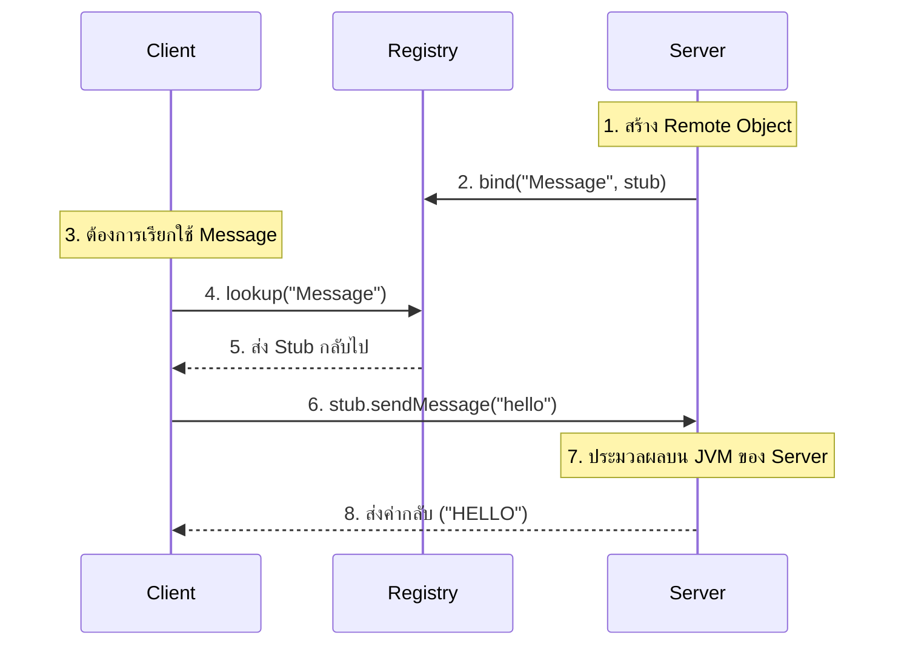

# การทำงานของ Java RMI (Remote Method Invocation)

Java RMI คือเทคนิคที่ยอมให้โปรแกรมที่รันบน Java Virtual Machine (JVM) หนึ่ง สามารถเรียกใช้งานเมธอดของออบเจกต์ที่อยู่บนอีก JVM หนึ่งได้ (มักจะอยู่คนละเครื่องกัน)

## องค์ประกอบหลักในระบบ

เพื่อให้ RMI ทำงานได้ จะมีองค์ประกอบที่ทำงานร่วมกันดังนี้:

1.  **Remote Interface (`Message.java`)**: เป็นตัวกำหนดว่าเมธอดไหนบ้างที่ฝั่ง Client สามารถเรียกใช้ได้ ต้อง `extends Remote`
2.  **Server Implementation (`Server.java`)**: เป็นตัวที่เก็บ logic การทำงานจริงของเมธอดนั้นๆ
3.  **RMI Registry**: เปรียบเสมือน "สมุดโทรศัพท์" ที่เก็บชื่อของบริการและตำแหน่ง (Stub) ของออบเจกต์นั้นไว้
4.  **Stub (ฝั่ง Client)**: เป็นตัวแทนของออบเจกต์จริงที่อยู่บน Server เมื่อ Client เรียกใช้เมธอด Stub จะจัดการส่งข้อมูลผ่านเครือข่ายไปหา Server
5.  **Skeleton (ฝั่ง Server)**: (ใน Java รุ่นใหม่จะรวมอยู่ใน RMI layer) ทำหน้าที่รับข้อมูลจาก Stub แล้วไปเรียกใช้เมธอดจริงๆ บน Server และส่งผลลัพธ์กลับไป

---

## ขั้นตอนการทำงาน (Step-by-Step)

### 1. ฝั่ง Server (การเตรียมบริการ)

- Server สร้างออบเจกต์ที่อ้างอิงจาก `Message` interface
- Server ทำการ **Export** ออบเจกต์นั้น (ใช้ `UnicastRemoteObject.exportObject`) เพื่อให้สามารถรับการเชื่อมต่อจากภายนอกได้
- Server นำออบเจกต์นั้นไปจดทะเบียนที่ **Registry** ด้วยชื่อที่กำหนด (ในโค้ดคือชื่อ `"Message"`)

### 2. ฝั่ง Registry (การค้นหา)

- Registry จะเก็บ **Stub** (ตัวแทน) ของออบเจกต์นั้นไว้คู่กับชื่อ `"Message"`

### 3. ฝั่ง Client (การเรียกใช้งาน)

- Client ติดต่อไปที่ Registry เพื่อขอค้นหาชื่อ `"Message"` (`registry.lookup("Message")`)
- สิ่งที่ Client ได้กลับมาไม่ใช่ตัวออบเจกต์จริงๆ แต่เป็น **Stub**
- เมื่อ Client เรียก `stub.sendMessage(sentence)`:
  1. **Stub** จะทำการดักจับการเรียกนั้น
  2. **Stub** จะห่อหุ้มข้อมูล (Marshalling) แล้วส่งข้าม Network ไปที่ Server
  3. **Server** รับข้อมูลมา ประมวลผลในเมธอดจริง
  4. **Server** ส่งผลลัพธ์กลับมาทาง Network
  5. **Stub** รับผลลัพธ์มาส่งต่อให้ตัวแปรในโค้ดฝั่ง Client

---

## สรุป

- **Client** ไม่รู้เลยว่าออบเจกต์นั้นอยู่คนละเครื่อง มันแค่เรียกใช้ผ่าน Interface ปกติ
- **Registry** เป็นตัวกลางช่วยให้ Client หา Server เจอในตอนแรก
- **Stub** เป็นหัวใจสำคัญที่จัดการเรื่องความซับซ้อนของการสื่อสารผ่าน Network ให้เราโดยอัตโนมัติ

ไฟล์อ้างอิงในโปรเจกต์ของคุณ:

- ดูโครงสร้าง Interface ที่ [Message.java](file:///home/the1n/cs438/rmi/Message.java)
- ดูการ Register ที่ [Server.java](file:///home/the1n/cs438/rmi/Server.java)
- ดูการ Lookup ที่ [Client.java](file:///home/the1n/cs438/rmi/Client.java)
